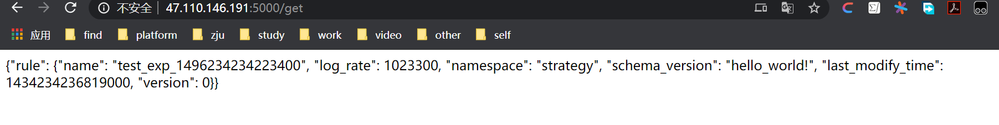

# flask搭建后端

## 目的

- 使用flask搭建服务器后端，完成前后端之间以`json`为格式的数据交互

## 服务器环境

- 阿里云Ubuntu 18.04
- python3环境
- pycharm(本地pc调试代码)

## 步骤

### 本地调试代码

#### 工程创建

- 使用pycharm创建以flask为框架的项目
- 

- 创建完成后，pycharm已经为我们预先写好了一个模板代码

#### 本地代码的编写和调试

- 这里简单的写了flask相应post和get请求，也就是收发数据

本地的json数据

```json
{
    "rule":{
        "namespace":"strategy",
        "name":"test_exp_1496234234223400",
        "version":0,
        "last_modify_time":1434234236819000,
        "log_rate":1023300,
        "schema_version":"hello_world!"
    }
}
```

本地代码app.py

```python
from flask import Flask
from flask import request
import json
app = Flask(__name__)


@app.route('/get', methods=['GET'])
def get_data():
    data = []
    with open("json/data.json", 'r') as f:
        data = json.load(f)
    return json.dumps(data)

//do not modify the following code
if __name__ == '__main__':
    app.run(host='0.0.0.0')
```

### 服务器虚拟环境搭建

#### 远程连接服务器

- xshell远程连接我们在阿里云上的服务器
- 

#### 搭建虚拟环境

- 安装虚拟环境需要的包

- ```bash
  sudo apt install python-virtualenv
  ```

- 创建虚拟环境

- ```bash
  virtualenv flask
  ```

- 这就完成了一个以flask为名称的虚拟环境的的创建

#### 安装flask需要的包

- 首先我们能够看到创建虚拟环境之后，我们生成的目录
- 

- 激活虚拟环境

- 
  - 通过上图我们看到，我们已经激活了名为flask的虚拟环境

  - 安装flask包

  - ```
    pip install flask uwsgi
    ```

由此，能够运行flask的虚拟环境已经创建完成

#### 部署app.py

- 将本地写好的代码移动到服务器上(我的服务器搭建了ftp，因此直接通过ftp传输即可)
  
  - 如果没有搭建ftp，则可以新建一个文件然后把本地代码粘贴到这个文件里
  
- 在flask/下新建一个app文件夹，把app.py放到这个文件夹下

- 在app文件夹下新建一个名为`json`的文件夹，将我们需要用到的json文件都放在这个目录下

  - 注意：不管是要保存还是要返回json文件，都要在app.py同级目录新建一个文件夹存放json文件，否则在部署的时候会出现访问不到文件的问题

- 

- 运行app,py

- ```
  python app.py
  ```

- 

- 我们输入服务器的ip和端口，先检查读取并返回数据的功能
  - 这里要注意的是，我们在使用阿里云服务器的时候，要在安全组规则中打开5000和80端口
  - 

##### 呈现效果

- 这个效果是读取服务器上的json数据并返回
- 

## 拓展

### 本地向服务器发送数据

- 此处代码以java代码为例

#### 本地代码

